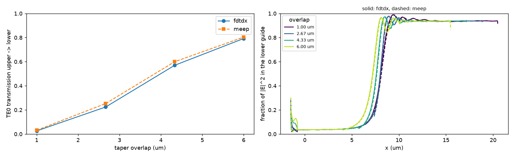

# FDTD with fdtdx

`gdsfactory.fdtdx_stack.StackDevice` turns a component and its
[`LayerStack`](https://gdsfactory.github.io/gdsfactory/notebooks/03_layer_stack/)
into a single [fdtdx](https://github.com/ymahlau/fdtdx) object. Every
`LayerLevel` of the stack is voxelized into one multi-material region, and the
result is differentiable with respect to:

- the polygon vertices of every layer, and therefore the parameters of the cell
  function that drew them;
- the thickness and sidewall angle of every level.

The device also builds a simulation volume that fits it and places sources and
detectors directly on the component's ports. You don't export a GDS, and you
don't re-describe the geometry with fdtdx primitives.

Install the integration with the `fdtdx` extra (requires `fdtdx >= 0.6.2`):

```bash
pip install "gdsfactory[fdtdx] @ git+https://github.com/Sephiram591/gdsfactoryx.git"
```

## Workflow

1. Build the device with `StackDevice.from_layer_stack(component, layer_stack, materials, background, ...)`.
2. Get the matching simulation volume with `stack.get_simulation_volume()`.
3. Put sources and detectors on ports with the `stack.create_<object>_at(port, ...)` methods.
4. Place everything with `fdtdx.place_objects` and merge `init_stack_params(objects)` into the params.
5. Apply the device with `apply_stack` instead of `fdtdx.apply_params`, then run `fdtdx.run_fdtd`.

### 1. Build the device

```python
import fdtdx
import gdsfactory as gf
from gdsfactory.fdtdx_stack import StackDevice, apply_stack, init_stack_params
from gdsfactory.technology import LayerLevel, LayerStack

gf.gpdk.PDK.activate()

layer_stack = LayerStack(
    layers={
        "box": LayerLevel(layer="WAFER", zmin=-3.0, thickness=3.0, material="sio2", mesh_order=9),
        "core": LayerLevel(layer=(1, 0), zmin=0.0, thickness=0.22, material="si", mesh_order=1),
    }
)
materials = {
    "air": fdtdx.Material(),
    "si": fdtdx.Material(permittivity=3.48**2),
    "sio2": fdtdx.Material(permittivity=1.444**2),
}

stack = StackDevice.from_layer_stack(
    gf.components.mmi1x2(),
    layer_stack,
    materials,
    background="air",
    included_layers=["core"],                 # z range of the box: the core ...
    extend_ports=(("o1", 1.0), ("o2", 1.0), ("o3", 1.0)),  # ... plus straight leads out of the ports ...
    boundary_offset=(0, 0, 1, -1, 1, -1),     # ... grown by 1 um in y and z
    name="stack",
)
```

- `materials` maps every `LayerLevel.material` that is drawn, plus `background`,
  to an `fdtdx.Material`. The background fills everything no level covers.
- The box starts as the xy bounding box of the polygons, including the port
  extensions, and the z range of `included_layers`.
  `boundary_offset = (x+, x-, y+, y-, z+, z-)` moves its faces in µm without
  changing the geometry. Every level that overlaps the box is drawn, including
  levels outside `included_layers` such as the `box` oxide above.
- `extend_ports` adds a straight waveguide to each listed port, on the port's
  layer and with the port's width. Use it to run waveguides through the PML. The
  extensions are polygons like any other: they get the level's thickness,
  sidewall angle and bias, and they follow the port when the component's
  parameters change.
- Layers in `fill_layers` (default `WAFER`) cover the whole plane.

The voxelization supports most of `LayerLevel`:

- logical and derived layers;
- `mesh_order` priorities, where the lower value wins;
- `sidewall_angle`, `width_to_z`, `bias` and `z_to_bias`;
- background levels.

### 2. Volume, sources and detectors

```python
volume, constraints = stack.get_simulation_volume()
objects = [volume, stack]
wave = fdtdx.WaveCharacter(wavelength=1.55e-6)
for obj, c in (
    stack.create_mode_plane_source_at("o1", (3, 4), wave_character=wave, port_offset=-0.5),
    stack.create_mode_overlap_detector_at("o2", (3, 4), wave_characters=(wave,), name="out"),
):
    objects.append(obj)
    constraints += c
```

Each `create_*_at` method centers a plane on a port and orients the plane
normal to the port. It returns the object together with its position
constraints. The common arguments are:

| Argument | Meaning |
| --- | --- |
| `port` | port name |
| `port_size_mult` | `(a, b)`: the plane is `a` × port width wide and `b` × level height tall |
| `direction` | `"in"` (into the component) or `"out"`; sources default to `"in"`, detectors to `"out"` |
| `port_offset` | shift in µm along the injection direction; negative values move the plane out of the component, e.g. into a port extension |
| `level` | level whose z span sets the plane's height (default: the levels drawing the port's layer) |

Available objects:

| Method | fdtdx object |
| --- | --- |
| `create_mode_plane_source_at` | `ModePlaneSource` |
| `create_gaussian_plane_source_at` | `GaussianPlaneSource` |
| `create_uniform_plane_source_at` | `UniformPlaneSource` |
| `create_hard_constant_amplitude_plane_source_at` | `HardConstantAmplitudePlanceSource` |
| `create_point_dipole_source_at` | `PointDipoleSource` |
| `create_mode_overlap_detector_at` | `ModeOverlapDetector` |
| `create_poynting_flux_detector_at` | `PoyntingFluxDetector` |
| `create_phasor_detector_at` | `PhasorDetector` |
| `create_field_detector_at` | `FieldDetector` |
| `create_energy_detector_at` | `EnergyDetector` |
| `create_diffractive_detector_at` | `DiffractiveDetector` |

Any other fdtdx fields can be passed as keyword arguments. Add boundaries,
regular fdtdx devices and other objects as usual.

### 3. Place, apply and run

```python
import jax
import jax.numpy as jnp

config = fdtdx.SimulationConfig(time=200e-15, resolution=20e-9, dtype=jnp.float32)
pml = fdtdx.BoundaryConfig.from_uniform_bound(thickness=25)
boundaries, c = fdtdx.boundary_objects_from_config(pml, volume)
objects += boundaries.values()
constraints += c

key = jax.random.PRNGKey(0)
objects, arrays, params, config, _ = fdtdx.place_objects(objects, config, constraints, key)
params = {**params, **init_stack_params(objects)}
arrays, objects, _ = apply_stack(arrays, objects, params, key)
_, arrays = fdtdx.run_fdtd(arrays=arrays, objects=objects, config=config, key=key)
```

fdtdx's own `Device` objects only mix two materials, so `fdtdx.apply_params`
doesn't know about a `StackDevice`. `apply_stack` writes every stack into the
arrays first and then calls `fdtdx.apply_params`, so regular devices and sources
are still updated, and devices win where they overlap a stack.

## Gradients through the simulation

The stack's parameters live in `params[name]`, in stack units (µm and degrees):

```python
params["stack"] = {
    "vertices/<layer>": ...,       # (E, 2), one entry per source layer with polygons
    "thickness/<level>": ...,      # ()
    "sidewall_angle/<level>": ..., # ()
}
```

To differentiate with respect to a cell parameter, rebuild the component inside
the objective and swap in its vertices with `stack.pack`:

```python
stack = objects["stack"]

def transmission(width):
    p = {**params, "stack": {**params["stack"], **stack.pack(gf.components.mmi1x2(width_mmi=width))}}
    arrays2, objects2, _ = apply_stack(arrays, objects, p, key)
    _, arrays2 = fdtdx.run_fdtd(arrays=arrays2, objects=objects2, config=config, key=key)
    return jnp.abs(objects2["out"].compute_overlap(arrays2.detector_states["out"])) ** 2

jax.grad(transmission)(2.5)
```

`pack` requires the same polygon topology as the component the device was built
from, meaning the same number of polygons and vertices per polygon on every
layer. It raises `ValueError` when the topology changes; in that case, rebuild
the device. Thicknesses and sidewall angles are ordinary entries of the params
dict and can be differentiated directly.

As with the layout backend, don't wrap the cell function in `jax.jit`; see
[Differentiable layouts](differentiable.md). Simulations with lossy materials
should use `fdtdx.GradientConfig(method="checkpointed")`, because fdtdx's
reversible gradients amplify round-off in lossy voxels. `StackDevice` warns
when it detects that combination.

## Geometry model

- **Signed distances.** Each source layer gets a 2D signed distance field to the
  union of its polygons, differentiable in the vertices
  (`gdsfactory.fdtdx_geometry.signed_distance`). Overlapping and abutting
  polygons merge without seams, and partly shared junction edges (a taper on the
  side of an MMI) are made exactly shared. Derived layers combine the fields:
  `or` takes the min, `and` the max, and `not` is `max(a, -b)`.
- **Sidewalls.** A level at height `z` offsets its distance by
  `(z - z_ref)·tan(sidewall_angle) - bias - z_to_bias(z)`, with
  `z_ref = zmin + width_to_z·thickness`.
- **Painting.** Levels are painted by increasing `mesh_order` by clipping each
  voxel exactly, both laterally and along z between the level surfaces. The
  background gets the rest. `xy_subsamples` refines the lateral fill at polygon
  corners and narrow tips, at a cost of roughly `s²`.
- **Permittivity averaging.** `averaging="subpixel"` (default) is Kottke subpixel
  averaging along the local interface normal; it also handles films thinner than
  a voxel and 2D simulations. With `yee_staggered=True` (default), each E
  component is sampled at its own Yee position. `averaging="inverse"` is fdtdx's
  inverse-permittivity average. Conductivity is averaged linearly.

### Dispersive materials

Materials can carry an `fdtdx.DispersionModel` (Lorentz or Drude poles), in
which case `Material.permittivity` is ε∞. All stack materials share the same
pole slots, one per distinct `(omega_0, gamma)`. Each voxel then mixes the pole
strengths, which mixes the susceptibilities exactly:
`ε(ω) = ε∞,mix + Σ w_m χ_m(ω)`. Each slot costs memory and time over the whole
simulation, so materials that share poles also share slots. With mode or
plane-wave sources in a dispersive simulation, `apply_stack` can't run inside
`jax.jit` (a limitation of fdtdx 0.6.2), but `jax.grad` works.

### Surface roughness

`TopRoughness` displaces the top surface of one level with a Gaussian random
field:

```python
from gdsfactory.fdtdx_stack import TopRoughness

stack = StackDevice.from_layer_stack(
    ...,
    roughness=[TopRoughness(level="core", rms=0.005, correlation_length=0.05)],
)
```

Dips are filled by the levels deposited on that surface. With
`fill_above=True`, their bottoms follow the surface down. Any other level
covering that height also fills them, by `mesh_order`. Pass `noise_key` to
`apply_stack` to draw a new realization, or `apply_roughness=False` for the
nominal geometry. `slab_margin` (default 0.05 µm) must cover the roughness
amplitude and any thickness changes you optimize over.

## Example: elevator coupler

[`examples/fdtdx_elevator_coupler.py`](https://github.com/Sephiram591/gdsfactoryx/blob/main/examples/fdtdx_elevator_coupler.py)
simulates an adiabatic coupler between two SiN tapers on different levels. TE0
at 619 nm is launched into the upper taper, and the script sweeps the taper
overlap. [`examples/meep_elevator_coupler.py`](https://github.com/Sephiram591/gdsfactoryx/blob/main/examples/meep_elevator_coupler.py)
runs the same structure in MEEP, and
[`examples/compare_elevator_coupler.py`](https://github.com/Sephiram591/gdsfactoryx/blob/main/examples/compare_elevator_coupler.py)
plots the two together:



Run the fdtdx example on a GPU:

```bash
python examples/fdtdx_elevator_coupler.py
```
